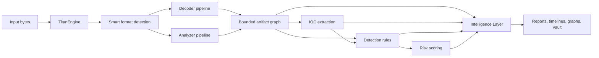

# Titan Decoder Engine

**Deterministic recursive payload decoding, forensic provenance, IOC extraction, detection, and analyst-oriented intelligence.**

[](https://github.com/pragmaconflux/titan1/actions/workflows/tests.yml)
[](pyproject.toml)
[](LICENSE)

Titan Decoder Engine is a dependency-light Python framework for analyzing encoded, compressed, archived, and structured payloads. It builds a bounded transformation graph, records provenance for every artifact, extracts indicators, evaluates detections, computes risk, and produces deterministic Intelligence summaries for analysts.

> Titan processes untrusted content. Run it in a sandbox when possible. Do not upload real incident data to public issues. See [SECURITY.md](SECURITY.md).

## Contents

- [Why Titan](#why-titan)
- [Feature matrix](#feature-matrix)
- [Architecture](#architecture)
- [Installation](#installation)
- [Quick start](#quick-start)
- [CLI workflow](#cli-workflow)
- [Pipelines](#pipelines)
- [Intelligence, detections, and risk](#intelligence-detections-and-risk)
- [Evidence and provenance](#evidence-and-provenance)
- [Graph exports](#graph-exports)
- [Plugin API](#plugin-api)
- [Report contracts](#report-contracts)
- [Testing and development](#testing-and-development)
- [Documentation map](#documentation-map)

## Why Titan

Titan is designed for repeatable analysis rather than opaque “best guess” decoding.

- **Deterministic:** stable decoder ordering, bounded recursion, ordered output, and explicit report contracts.
- **Explainable:** each node records parentage, transformation method, hashes, score, and provenance.
- **Defensive:** resource limits, decompression caps, timeouts, node caps, and malformed-input recovery.
- **Extensible:** built-in decoders and analyzers share interfaces with external plugins.
- **Pipeline-friendly:** JSON, JSONL, IOC, timeline, case-report, and graph exports.
- **Offline-first:** the core engine uses the Python standard library; enrichment is optional.

## Feature matrix

| Area | Capabilities |
|---|---|
| Recursive decoding | Base64 variants, ASCII85, Base58, Base91, PEM, Hex, ROT13, PowerShell EncodedCommand, JavaScript/URL/HTML/Unicode escapes, UTF-16, XOR |
| Compression | Gzip, Bz2, LZMA, Zlib, raw Deflate, and optional Brotli/Zstandard with bounded output |
| Opt-in decoders | Base32, UUEncode, ASN.1, Quoted-Printable |
| Structural formats | PDF, OLE/CFB, RFC/MIME email, OOXML/XLM, RTF, MSI, OneNote embedded files, scripts, Windows LNK, and image/media steganography artifacts |
| Embedded payloads | Bounded carving of base64/base64url/hex regions out of host files, with byte-offset provenance |
| Archive analysis | ZIP/TAR plus optional 7z, RAR, ISO, and CAB extraction with count/size/ratio limits |
| Executables | Deeper PE/ELF section, entropy, import, entry-point, overlay, interpreter, and anomaly analysis |
| Indicators | URLs, domains, IPs, emails, hashes, and normalized evidence indicators |
| Detection | Built-in correlation rules, optional rule packs, and bounded YARA scanning of every artifact node (raw, decoded, and extracted content) |
| Risk | Deterministic 0–100 risk assessment |
| Intelligence | Classification, scored signals, artifact ranking, confidence, recommendation |
| Threat intelligence | MITRE ATT&CK technique mapping, LOLBin identification, behavioral malware tags, node relationships |
| Evidence | DNS, proxy, firewall, VPN, auth, DHCP, and generic CSV/JSONL ingestion |
| Exports | JSON, JSONL, IOC formats, Markdown/HTML case reports, timelines, JSON/DOT/Mermaid graphs |
| Operations | Native/terminal UI, batch and deep scan, recoverable quarantine, calibration gates, local vault, offline guard |
| Assurance | Six fail-closed controls, VM/provenance adapters, and optional Authenticode verification |
| Extensions | Out-of-process manifest plugins with time/output/memory bounds; legacy plugins remain in-process |

## Architecture



The engine separates transformation, analysis, interpretation, and export. More detailed diagrams are in [docs/ARCHITECTURE.md](docs/ARCHITECTURE.md) and [docs/diagrams/](docs/diagrams/).

## Installation

Titan requires Python 3.10 or newer.

### Install from GitHub

```bash
pip install "titan-decoder[desktop-ui] @ git+https://github.com/pragmaconflux/titan1.git"
```

### Editable developer install

```bash
git clone https://github.com/pragmaconflux/titan1.git
cd titan1
python -m venv .venv
source .venv/bin/activate
pip install -e '.[dev,workbench-ui,desktop-ui,formats]'
pip install 'yara-python>=4.5.4'
```

Install optional Brotli, Zstandard, 7z, RAR, ISO, and CAB support with
`pip install -e '.[formats]'`.

On Debian-derived systems, use a virtual environment rather than installing into the externally managed system Python.

The install provides one application command: `titan`. Running it opens the
native desktop workbench. Advanced terminal, service, analyst, and automation
interfaces remain available as `titan` subcommands; run `titan --help` to see
them.

## Quick start

```bash
titan
```

That is the complete normal-user workflow. On Windows, the supported native
configuration uses a PySide6 front end and a Debian analysis backend through
WSL. Follow the one-time setup in the
[Windows Desktop Workbench guide](docs/WINDOWS_DESKTOP_UI.md), then launch
`Titan-Windows.cmd`. Native Explorer drag-and-drop is available in this build.

### Advanced command-line use

The same `titan` executable exposes the scriptable engine when required:

```bash
titan cli --file suspicious.bin --out report.json
```

Deep-scan a folder without executing samples and copy only confirmed malicious
verdicts into recoverable quarantine:

```bash
titan cli --deep-scan ./incoming --offline \
  --quarantine-verdict malicious --quarantine-action copy \
  --deep-scan-out scan-summary.json
```

Run the labeled decoder/analyzer quality gate:

```bash
titan cli --calibrate tests/fixtures/calibration/decoder-analyzer-v1.json
```

For the optional terminal workbench, install `.[workbench-ui]` and run
`titan tui`.

Add detections, risk, a readable explanation, and a separate Intelligence object:

```bash
titan cli \
  --file suspicious.bin \
  --enable-detections \
  --explain \
  --intelligence-out intelligence.json \
  --out report.json
```

Generate investigator-facing reports and an annotated graph:

```bash
titan cli \
  --file suspicious.bin \
  --enable-detections \
  --report-out case-report.html \
  --report-format html \
  --graph analysis.mmd \
  --graph-format mermaid \
  --out report.json
```

## CLI workflow

The CLI is organized as explicit stages:

1. Parse arguments and configuration.
2. Handle informational commands.
3. Load the input.
4. Parse optional external evidence.
5. Run recursive analysis.
6. Attach evidence.
7. Run detections and risk scoring.
8. Attach deterministic Intelligence.
9. Attach deterministic Threat Intelligence (ATT&CK, LOLBins, behavioral tags).
10. Run optional enrichment.
11. Write reports, timelines, graphs, JSONL, and vault records.

Common commands:

```bash
titan cli --help
titan cli --doctor
titan cli --list-decoders
titan cli --list-analyzers
titan cli --print-schema-version
```

See [docs/DEVELOPER_GUIDE.md](docs/DEVELOPER_GUIDE.md) for stage-level internals and [docs/USAGE.md](docs/USAGE.md) for operational examples.

## Pipelines

### Decoder pipeline

Decoders answer: “Can these bytes be transformed into another meaningful representation?”

Each candidate transformation is scored, bounded, deduplicated by content hash, and inserted as a child node. The engine recursively explores accepted children until it reaches configured depth, node, time, memory, or size limits.

### Analyzer pipeline

Analyzers answer: “Does this object contain structured artifacts or metadata?”

Archive and structured-file analyzers can emit named child artifacts, such as archive members, OLE streams, embedded files, or executable metadata. Their output enters the same provenance graph as decoder output.

See [docs/PIPELINES.md](docs/PIPELINES.md).

## Intelligence, detections, and risk

These components are related but intentionally separate:

- **Detection rules** identify explicit patterns and correlations.
- **Risk scoring** combines detections and report characteristics into an operational severity.
- **Intelligence** creates an analyst-oriented classification, ordered signals, ranked artifacts, confidence, and recommendation.
- **Threat Intelligence** maps evidence to a bundled offline MITRE ATT&CK subset, identifies LOLBin usage, and emits behavioral malware tags — see [docs/THREAT_INTELLIGENCE.md](docs/THREAT_INTELLIGENCE.md).

The Intelligence object is deterministic and versioned. Its `1.0` contract is defined by:

- `schemas/intelligence-report-v1.0.schema.json`
- `docs/INTELLIGENCE_LAYER.md`
- `tests/fixtures/intelligence/calibration-v1.json`

See [docs/INTELLIGENCE_LAYER.md](docs/INTELLIGENCE_LAYER.md) and [docs/DETECTION_AND_RISK.md](docs/DETECTION_AND_RISK.md).

## Evidence and provenance

Every graph node retains derivation context, including its parent, method, hashes, score, artifact name, and provenance record.

External incident-response evidence can be ingested with repeated `--evidence KIND:PATH` arguments:

```bash
titan cli \
  --file suspicious.bin \
  --evidence dns:logs/dns.csv \
  --evidence proxy:logs/proxy.csv \
  --evidence firewall:logs/flows.jsonl \
  --out report.json
```

Titan normalizes evidence into events and indicators, then derives last-seen information, pivots, entity hints, and evidence links.

See [docs/EVIDENCE_AND_PROVENANCE.md](docs/EVIDENCE_AND_PROVENANCE.md).

## Graph exports

```bash
titan cli --file sample.bin --graph graph.json --graph-format json
titan cli --file sample.bin --graph graph.dot --graph-format dot
titan cli --file sample.bin --graph graph.mmd --graph-format mermaid
```

When the report contains Intelligence data, exports include:

- graph-level classification, score, confidence, and signal codes;
- per-node priority annotations for ranked artifacts;
- DOT legends and highlighted nodes;
- Mermaid summary and priority classes.

When it contains Threat Intelligence data, exports also include graph-level
technique/tactic/LOLBin/tag metadata and per-node ATT&CK, LOLBin, and
behavioral-tag annotations in JSON, DOT, and Mermaid outputs.

Consumers that do not use Intelligence retain the previous graph structure.

See [docs/GRAPH_EXPORTS.md](docs/GRAPH_EXPORTS.md).

## Plugin API

Titan loads decoders and analyzers from configured plugin directories, the user plugin directory, and built-in plugins. Plugins should:

- implement the matching base interface;
- provide a stable name;
- return deterministic results;
- enforce their own input/output bounds;
- avoid network activity unless explicitly configured;
- include focused tests.

See [docs/PLUGIN_API.md](docs/PLUGIN_API.md).

Manifest plugins execute in short-lived worker processes by default. Process,
time, memory, output, offline-network, and configuration-disclosure controls
reduce extension risk, but they are not a substitute for an operating-system
sandbox. Legacy single-file plugins retain their in-process compatibility mode.

## Report contracts

The primary report includes metadata, a run manifest, nodes, IOCs, optional evidence, detections, risk, Intelligence, and enrichment.

Titan maintains multiple contracts:

- main report schema version in `titan_decoder.core.engine`;
- Intelligence JSON Schema `1.0`;
- deterministic calibration fixtures;
- compatibility and strict-mode tests.

See [docs/REPORT_SCHEMA.md](docs/REPORT_SCHEMA.md).

## Testing and development

```bash
pip install -e '.[dev,desktop-ui]'
python -m pytest
ruff check .
mypy titan_decoder
```

Focused suites:

```bash
python -m pytest tests/test_intelligence.py tests/test_intelligence_contract.py
python -m pytest tests/test_case_report_intelligence.py
python -m pytest tests/test_graph_export.py tests/test_graph_intelligence.py
```

Security-sensitive changes should include malformed-input, bound, and regression tests.

See [docs/TESTING.md](docs/TESTING.md) and [CONTRIBUTING.md](CONTRIBUTING.md).

## Documentation map

| Document | Purpose |
|---|---|
| [Documentation index](docs/DOCUMENTATION_INDEX.md) | Complete operator, developer, and maintainer map |
| [Project charter](docs/PROJECT_CHARTER.md) | Mission, core principles, scope, and governance |
| [Depth-hardening program](docs/DEPTH_HARDENING.md) | Ordered plan for content, corpus, parser, assurance, and trust depth |
| [Architecture](docs/ARCHITECTURE.md) | Components, boundaries, and system diagrams |
| [CLI reference](docs/CLI_REFERENCE.md) | Command groups, outputs, and examples |
| [Windows desktop workbench](docs/WINDOWS_DESKTOP_UI.md) | Native setup, Debian bridge, drag-and-drop, and troubleshooting |
| [Integrated workbench](docs/WORKBENCH_INTEGRATED_BUILD.md) | Native and Textual interface commands, operation, and safety behavior |
| [Assurance pipeline](docs/ASSURANCE_PIPELINE.md) | Six fail-closed controls, verdict policy, VM and provenance attestations |
| [Deep scan and quarantine](docs/DEEP_SCAN_AND_QUARANTINE.md) | Recursive static scanning, quarantine policy, and restoration |
| [Calibration](docs/CALIBRATION.md) | Labeled decoder/analyzer quality metrics and gates |
| [MSI and OneNote analysis](docs/MSI_AND_ONENOTE_ANALYSIS.md) | Bounded installer and OneNote embedded-file recovery |
| [Pipelines](docs/PIPELINES.md) | End-to-end execution, decoder engine, and analyzer pipeline |
| [Developer guide](docs/DEVELOPER_GUIDE.md) | Repository layout and implementation workflow |
| [Intelligence Layer](docs/INTELLIGENCE_LAYER.md) | Signals, classification, ranking, and compatibility |
| [Detection and risk](docs/DETECTION_AND_RISK.md) | Rule evaluation and operational severity |
| [Evidence and provenance](docs/EVIDENCE_AND_PROVENANCE.md) | Normalized evidence and derivation records |
| [Graph exports](docs/GRAPH_EXPORTS.md) | JSON, DOT, Mermaid, and Intelligence annotations |
| [Plugin API](docs/PLUGIN_API.md) | Extension points and plugin requirements |
| [Report schema](docs/REPORT_SCHEMA.md) | Report fields and versioning |
| [Security model](docs/SECURITY_MODEL.md) | Threat model, controls, and operational guidance |
| [Testing](docs/TESTING.md) | Test strategy, commands, and CI expectations |
| [Contributing](CONTRIBUTING.md) | Contribution and review requirements |

## Project status

Titan is under active development. The deterministic core, report contracts,
and safety bounds take priority over feature breadth. Major surface expansion is
currently deferred in favor of the
[depth-hardening program](docs/DEPTH_HARDENING.md); longer-term work remains in
[docs/ROADMAP.md](docs/ROADMAP.md).

## License

GNU Affero General Public License v3.0 or later (AGPL-3.0-or-later). See [LICENSE](LICENSE).
