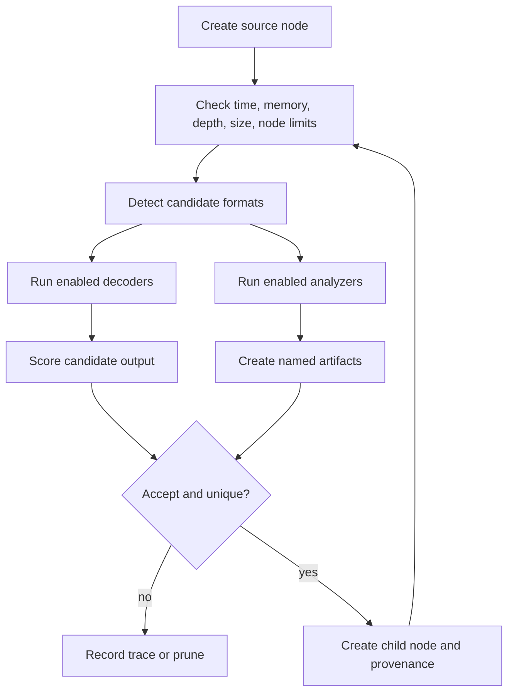
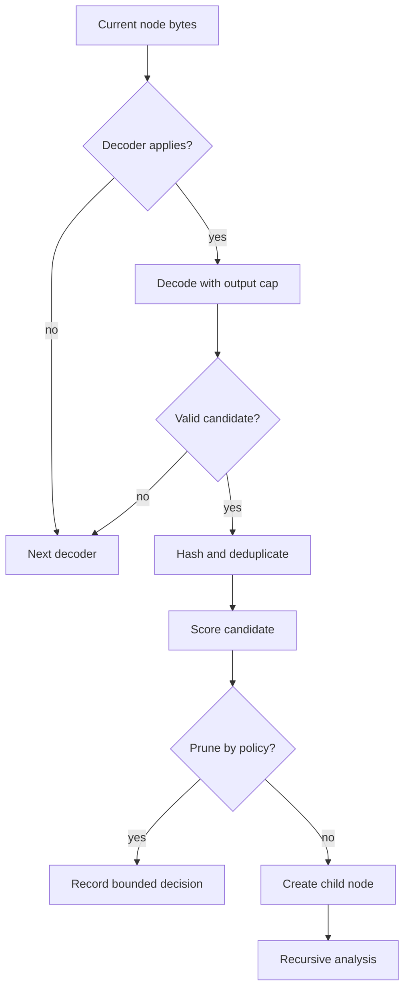
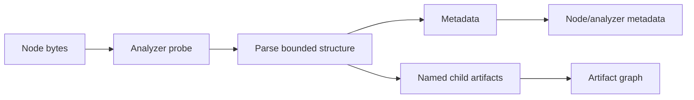

# Decoder and Analyzer Pipelines

Decoders transform one byte representation into another candidate representation. Analyzers identify structure — containers, executables, embedded objects, metadata — and may emit named child artifacts. Neither is responsible for final verdicts, risk, or analyst-facing conclusions. Both feed the same artifact graph.

## Recursive flow

## Scoring and pruning

Titan separates candidate scoring from hard resource limits. A low score may be pruned by policy; depth, node, memory, timeout, and output-size limits are non-negotiable safety boundaries.

## Deduplication

Content hashes prevent the same decoded bytes from being explored repeatedly. Parentage remains explicit for accepted artifacts, while deterministic ordering makes tie handling stable.

## Error behavior

Malformed content should produce no candidate or a bounded error record—not terminate the run. Unexpected programmer errors may be logged and surfaced in verbose mode.

## Decoder engine

### Lifecycle

1. The engine receives bytes for a node.
2. Smart detection and decoder applicability checks reduce unnecessary work.
3. Enabled decoders produce zero or more bounded candidates.
4. Candidate quality is scored.
5. Content hashes prevent duplicate exploration.
6. Accepted candidates become child nodes with explicit parentage.
7. Recursion continues until a hard or policy limit is reached.

### Built-in transformations

The default set includes Base64 variants, ASCII85, Base58, Base91, PEM armor,
common compression formats (including raw Deflate and optional
Brotli/Zstandard), Hex, ROT13, PowerShell EncodedCommand, JavaScript/URL/HTML
and Unicode escapes, UTF-16, XOR, PDF, and OLE processing. Base32, UUEncode,
ASN.1, and Quoted-Printable are opt-in or smart-detected because they can
create noisy candidates on arbitrary data.

### Decoder requirements

A decoder should cheaply determine whether it applies, transform bytes, reject malformed input without crashing, and provide a stable name.

**Determinism:** stable names, stable candidate ordering, and deterministic scoring inputs. Random sampling, environment-dependent ordering, and implicit network access are not permitted in the deterministic path.

**Resources:** expansion-capable decoders must cap output before allocating unbounded buffers. Repeated-key searches must constrain key lengths and sampled scoring. Decompression must enforce total output limits and reject expansion bombs. Heuristic decoders must avoid quadratic searches.

### Adding a decoder

- Implement the decoder base interface used by `titan_decoder.decoders.base`.
- Add configuration wiring in the engine.
- Add applicability, success, malformed-input, determinism, and resource-bound tests.
- Document whether the decoder is always enabled, opt-in, or smart-detected.
- Keep transformation metadata sufficient for provenance and edge labels.

## Analyzer pipeline

### Built-in analyzers

- ZIP and TAR analyzers enumerate bounded members and reject unsafe expansion.
- Optional 7z, RAR, ISO, and CAB libraries extend the same bounded archive path.
- RFC/MIME email, OOXML, script, and Windows LNK analyzers expose delivery
  metadata, decoded bodies, active content, relationships, and embedded objects.
- The steganography analyzer extracts bounded PNG/JPEG/GIF/WebP/TIFF metadata,
  MP3 tags, MP4/MOV atoms, appended data, and conservative LSB candidates.
- PE and ELF analyzers extract sections, imports/interpreters, entry points,
  overlays, entropy, permissions, and structural anomalies.
- PDF and OLE support in the decoding layer performs structural extraction for embedded objects and streams.
- The embedded-payload analyzer carves encoded regions out of host files.

### Embedded-payload carving

Decoders are whole-buffer transforms: `can_decode` inspects the entire input,
so a payload only decodes when the artifact *is* the encoded blob. Real samples
usually carry the blob **inside** a host — a base64 string assigned to a script
variable, a hex blob in an XML attribute, a registry export — where every
whole-buffer decoder correctly declines.

The `EmbeddedPayload` analyzer closes that gap. It scans a host buffer for runs
of encoded-alphabet characters, decodes each candidate independently, and emits
the ones that decode to something real as named child artifacts. Each carved
node records `origin: "carve"`, the producing pass, and the `source_offset` it
was recovered from, and then re-enters the normal decoder pipeline, so a
multi-layer chain unwinds on its own.

Carving **composes**: analyzers that return `composes == True` run in addition
to whichever format analyzer claims the node, rather than competing for the
single analyzer slot. A script is still script-analyzed after its embedded blob
is carved out.

Precision governs the heuristics. Long alphabet runs are common in benign
content — checksums, UUID tables, minified assets, embedded certificates — so a
candidate is emitted only when it clears a minimum run length, decodes cleanly,
and yields output carrying a known signature or overwhelmingly printable bytes.
Speculative noise is dropped rather than reported. Bounds are configurable via
`max_carved_artifacts`, `max_carved_artifact_size`, `max_carved_total_size`,
`max_carve_scan_bytes`, and `min_carved_run_length`.

### Artifact contract

An emitted artifact should include bounded bytes, a stable artifact name, the producing analyzer identity, and enough metadata for provenance. Archive member paths and OLE stream paths become provenance labels; they must be normalized and must never be used for unsafe filesystem writes.

### Safety rules

- Cap member count, per-member size, total extracted size, and compression ratio.
- Do not trust filenames, paths, offsets, lengths, or declared counts.
- Validate boundaries before slicing or allocating.
- Skip malformed entries without crashing the whole run.
- Preserve errors in logs or trace output when useful, but do not leak raw sensitive data.

### Testing analyzers

Use minimal valid fixtures, truncated variants, oversized declarations, duplicate members, path traversal names, nested archives, and deterministic ordering assertions.
